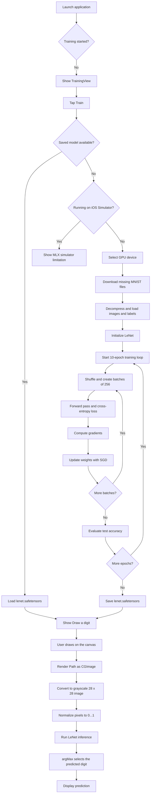

# MNISTTrainer

`MNISTTrainer` is a SwiftUI example that trains a LeNet-style convolutional
neural network with [MLX](https://github.com/ml-explore/mlx-swift) and then uses
the trained model to recognize a handwritten digit. It runs on macOS and iOS.

The application demonstrates the complete workflow:

1. Download and cache the MNIST dataset.
2. Create and train a LeNet model on the GPU.
3. Report test accuracy and epoch duration in the UI.
4. Render a handwritten digit from a SwiftUI canvas.
5. Convert the drawing to a normalized `28 x 28` `MLXArray` and classify it.
6. Save the trained model weights as a SafeTensors file for later inference.

## Project structure

- `MNISTTrainerApp.swift` — application entry point.
- `ContentView.swift` — training UI, observable training state, and
  `LeNetContainer`, which owns the model and training loop.
- `PredictionView.swift` — drawing canvas, image conversion, and inference UI.
- `../../Libraries/MLXMNIST/MNIST.swift` — LeNet architecture, loss, accuracy,
  and shuffled batch iteration.
- `../../Libraries/MLXMNIST/Files.swift` — MNIST downloads, gzip decompression,
  caching, and conversion to `MLXArray` values.

## Model and training configuration

The model is a LeNet-style network with the following layers:

```text
Input [batch, 28, 28, 1]
  -> Conv2d(1, 6, kernel: 5, padding: 2) -> Tanh -> MaxPool2d(2)
  -> Conv2d(6, 16, kernel: 5) -> Tanh -> MaxPool2d(2)
  -> Flatten
  -> Linear(400, 120) -> Tanh
  -> Linear(120, 84) -> Tanh
  -> Linear(84, 10)
```

Training uses:

- 10 epochs
- Batch size of 256
- SGD with a learning rate of `0.1`
- Cross-entropy loss
- A deterministic random seed (`0`) for reproducible batch ordering
- Test-set accuracy reported after every epoch

MNIST files are stored in the app's Application Support directory under:

```text
<Application Support directory>/mnist/data
```

Already downloaded files are reused on subsequent runs and are not subject to
the system's cache eviction policy. If the app has data from an older version
under `Caches/mnist/data`, it moves that data to the new location on the next
training run.

After training, the model weights are saved as:

```text
<Application Support directory>/MNISTTrainer/Models/lenet.safetensors
```

When the app starts a training flow, it loads this file when it exists and
skips retraining. The file contains the `LeNet` parameters only; optimizer
state and an intermediate training epoch are not saved, so this is intended
for restoring the model for inference rather than resuming an interrupted
training run.

## End-to-end flow



## Building and running

Open the workspace or project in Xcode and select the `MNISTTrainer` target.
On iOS, set a development Team for the target before building and running.

The app needs network access on its first training run because it downloads the
MNIST files. In the macOS App Sandbox, enable:

```text
Signing & Capabilities > App Sandbox > Outgoing Connections (Client)
```

The dataset is downloaded from one of several configured HTTPS mirrors in
`Libraries/MLXMNIST/Files.swift`. The target also contains the required App
Transport Security configuration for the data sources.

## Platform note

MLX evaluation is not supported by this example on the iOS Simulator. Running
the training flow there stops early with an explanatory message. Use a real
iPhone or iPad, or run the macOS target instead.

## Limitations

- Only model weights are saved. Optimizer state and intermediate epochs are
  not persisted, so interrupted training cannot currently be resumed.
- The prediction screen currently provides `Predict` and `Clear` actions but
  does not provide a button to return to the training screen.
